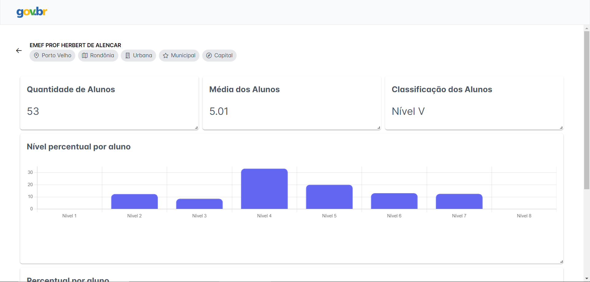
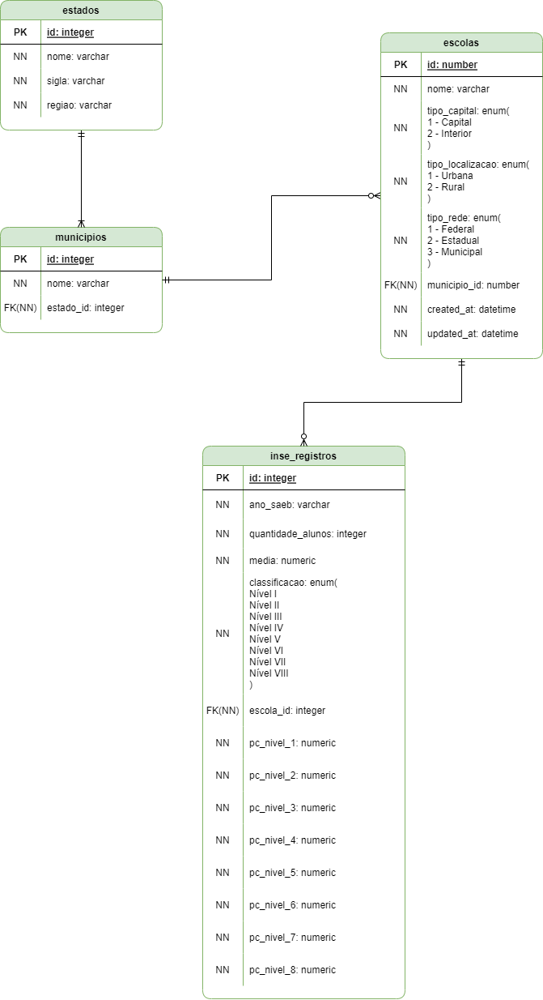

# Desafio projeto FNDE INSE 2021
Desafio para o processo seletivo do projeto FNDE onde o objetivo é extrair algumas informações dos dados do INSE 2021 e criar alguns relatórios. Os frameworks e bibliotecas escolhidas foram o Reactjs, Nextjs e Nestjs, para o banco de dados foi escolhido o postgresql.

O desafio foi concluído em 2 dias.

## Imagens do projeto em execução




## Modelagem do banco de dados


## Documentação da API
- [Documentação Postman](https://www.postman.com/martian-astronaut-427000/workspace/inse-dashboard/request/20554883-5e91c54c-08cd-4e9f-94f8-9d978bac7a2a)

## Requisitos do Projeto
- [Node.js](https://nodejs.org/) (recomendado v18 ou superior)
- [npm](https://www.npmjs.com/) (v6.x ou superior)
- [yarn](https://classic.yarnpkg.com/en/docs/install#windows-stable) (v1.22.x ou superior)
- [Docker](https://docs.docker.com/engine/install/)
- [Docker Compose](https://docs.docker.com/compose/install/)

## Configuração do Nestjs
### 1. Instalação do Node.js e npm

Certifique-se de ter o Node.js e o npm instalados em seu sistema. Você pode baixá-los em [nodejs.org](https://nodejs.org/).

### 2. Instalação do NestJS CLI

Instale o NestJS CLI globalmente caso queira utilizar os templates do nestjs:

```bash
npm install -g @nestjs/cli
```

### 3. Instalar os pacotes
Instale os pacotes utilizando o yarn:

```bash
yarn install # ou somente yarn
```

### 4. Configurar variáveis de ambiente
As variáveis de ambientes já estão configuradas no .env.example. 
Código para criar o .env:

```bash
cp .env.example .env
```

### 5. Configurar o banco de dados
Considerando que você já tem o docker e o docker compose instalados, execute o seguinte comando para subir o container do banco de dados:

```bash
docker compose up -d # ou docker-compose up -d
```

### 5. Rodar o projeto
Após instalar os pacotes você poderá iniciar o projeto:

```bash
yarn start:dev
```

## Configuração do Nextjs
### 1. Instalar os pacotes
Instale os pacotes utilizando o yarn:

```bash
yarn install # ou somente yarn
```

### 2. Configurar variáveis de ambiente
As variáveis de ambientes já estão configuradas no .env.example. 
Código para criar o .env.local:

```bash
cp .env.example .env.local
```

### 3. Rodar o projeto
Após instalar os pacotes você poderá iniciar o projeto:

```bash
yarn dev
```
